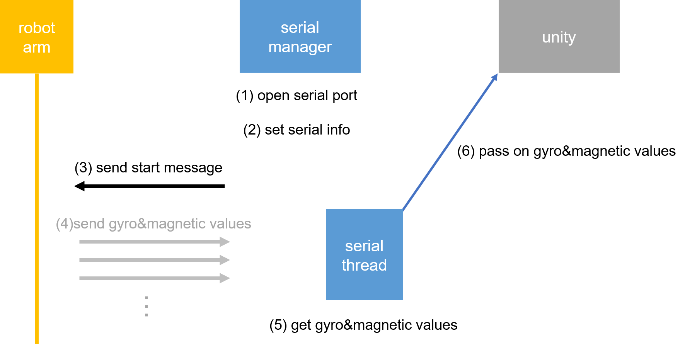
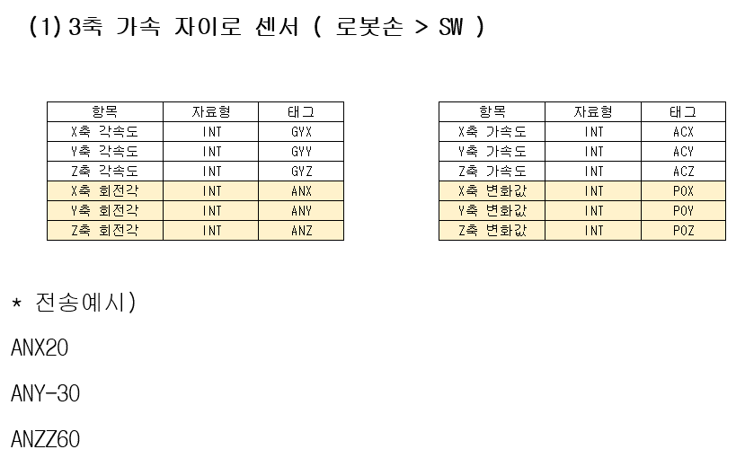
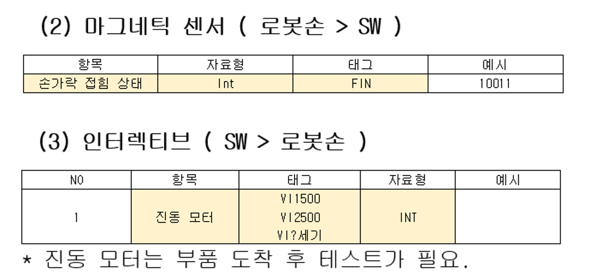
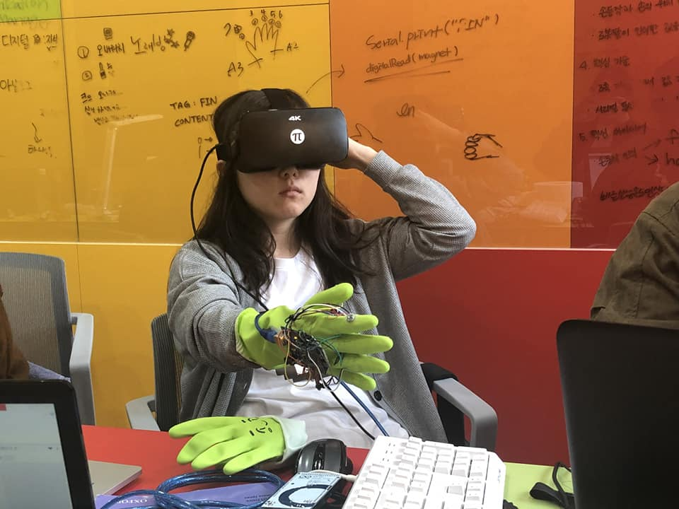
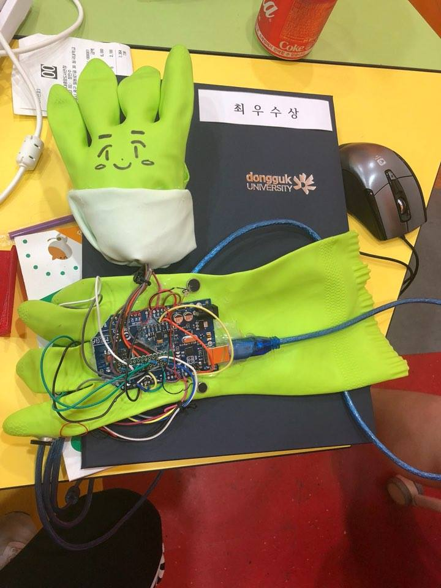

# 2018_robot_arm_project

## 로봇팔 프로젝트

창의적공학설계 팀프로젝트

 

### 설계

#### 시리얼 통신  

 

#### 3축 가속 자이로 센서  

 

#### 마그네틱 센서 및 진동 모터  

 

### 작품  

 

 

## 기술 스택

| Unity | C# | arduino |
| :--------: | :--------: | :--------: |
|      |       |  |

 

## 후기

- 착용하는 로봇팔을 구상함
- 로봇팔 설계부터 납땜, 구현까지 진행하였고, 로봇팔의 작동을 보여 줄 프로그램도 유니티로 개발했음
- 경진대회에서 1등 했음

 

## 라이센스

MIT &copy; [ITJEONG](mailto:derbana1027@gmail.com)
